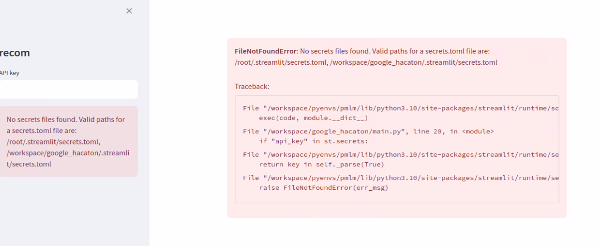
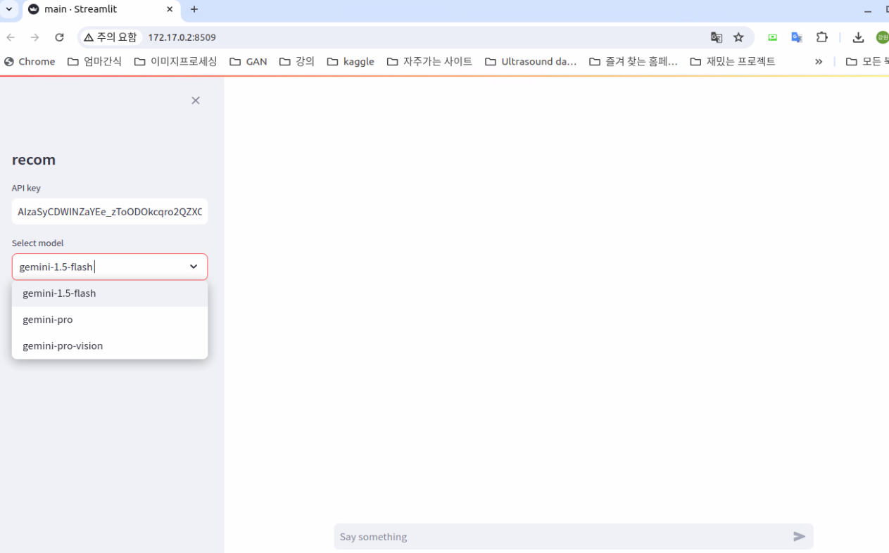

# google_gemini_hackathon
## execution
```
streamlit run main.py
```

- Ignore this error the first time and enter the API KEY

  

- Select a model after entering

## Chat example
```
me : I have heart disease

gemini:
I understand you have heart disease. To recommend the best exercises for you, I need some more information:

What type of heart disease do you have? This will help me understand the severity and limitations of your condition.
Do you have any other health conditions? This will help ensure the exercises are safe for you.
What is your current fitness level? This will help me tailor the exercise intensity and duration to your abilities.
What are your goals for exercise? Are you looking to improve your cardiovascular health, strength, or flexibility?
Do you have any pain or limitations with movement? This will help me recommend exercises that are safe and comfortable for you.
Once I have this information, I can create a personalized weekly workout plan with recommended exercises and YouTube videos to help you stay active and improve your health.

me:
I have heart failure and was diagnosed with Zinda 3 years ago. 
My current medication is prescribed by my doctor. 
I have recently experienced shortness of breath and chest pain. 
I am not currently in good physical condition and am not able to exercise regularly.
I would like to do light exercise and would like to do it 4 times a week if I have the stamina. 
I have pain in my joints.

gemini:
It's important to prioritize your health and safety, especially given your heart failure and recent symptoms. I strongly advise you to consult with your doctor before starting any new exercise program. They can assess your current condition, determine the safest level of activity for you, and address your concerns about shortness of breath and chest pain.

While I can't provide medical advice, I can offer some general ideas for light exercises you could discuss with your doctor:

For improving cardiovascular health:

Gentle Walking: Start with short walks around your house or neighborhood, gradually increasing the distance and duration as you feel comfortable. Focus on a comfortable pace and avoid pushing yourself too hard.
Cycling (stationary bike): A stationary bike allows you to control the intensity and resistance, making it a safer option than outdoor cycling.
For strengthening and flexibility:

Chair Exercises: These are great for improving strength and flexibility while minimizing strain on your joints. Examples include arm circles, leg lifts, and torso twists.
Gentle Yoga: Some poses can be adapted for seated positions, focusing on breathing and gentle stretching.
Key considerations:

Listen to your body: If you experience any pain, shortness of breath, or dizziness, stop immediately and rest.
Stay hydrated: Drink plenty of water before, during, and after exercise.
Start slowly and gradually increase the intensity and duration: Avoid pushing yourself too hard too soon.
Focus on your breathing: Take deep breaths and exhale slowly.
YouTube video ideas:

Chair Exercises for Seniors: [Insert link to a YouTube video of chair exercises for seniors]
Gentle Yoga for Beginners: [Insert link to a YouTube video of gentle yoga for beginners]
Breathing Exercises for Heart Failure: [Insert link to a YouTube video of breathing exercises for heart failure]
Remember, this is not medical advice. Please talk to your doctor before starting any new exercise program. Your doctor can tailor an exercise plan to your specific needs and ensure it is safe for you.

I wish you all the best in your journey towards better health.
```

## youtubu
[![Video]](https://youtu.be/7zhyAomOVTo)
